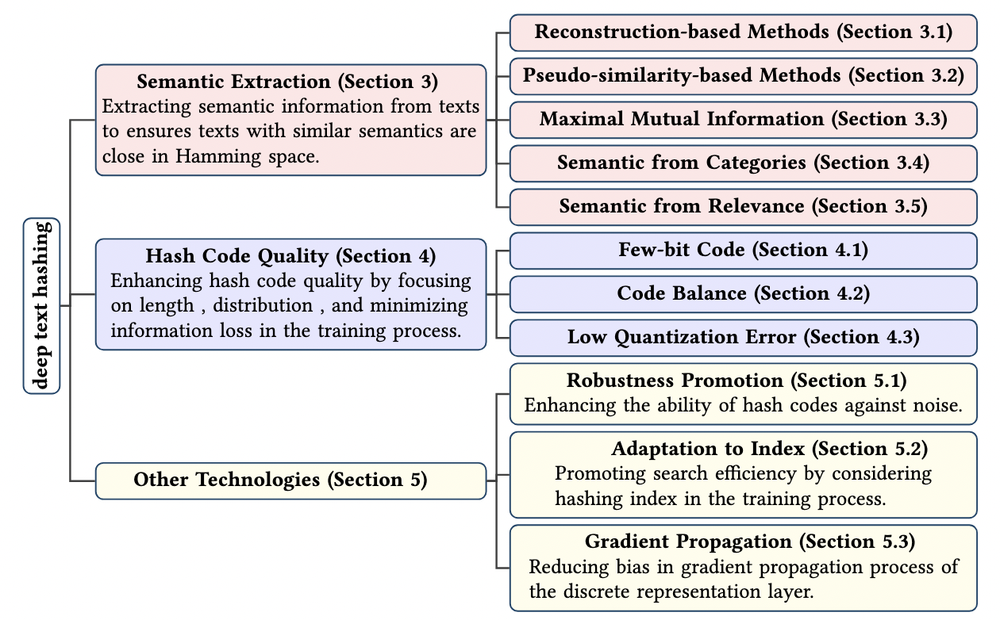

# A Survey on Deep Text Hashing

This repository offers a carefully curated selection of research papers centered on **deep text hashing**. It is based on our survey paper, **A Survey on Deep Text Hashing: Efficient Semantic Text Retrieval with Binary Representation**. The list will be updated regularly. Should you come across any inaccuracies or overlooked works, you are warmly encouraged to open an issue or submit a pull request.



## Category

- [Meaning of the Marker](#meaning_of_the_marker)
- [Paper List](#paper_list)
- [Datasets](#datasets_instruction)
- [Models](#models_instruction)
- [Acknowledgments](#acknowledgements)

## Meaning of the Marker

|  Marker    |  Meaning  |
| ---- | ---- |
|   |  Reconstruction-based method  |
|  -brightgreen) |  Applying A prior on the latent representation (X could be G: Gussain, B: Bernoulli, M: Mixture, C: Categorical, BM: Boltzmann, GA: Graph)|
|   |  Pseudo-similarity-based method |
|   |  Maximal mutual information method |
|   |  Learning semantic from categories |
|   |  Learning semantic from relevance |
|   |  Promoting code balance |
|   |  Promoting few-bit code |
|  -red) |  Using quantization method (X could be Loss: quantization loss, Sgn: Signum function, Sigmoid: Sigmoid function, Tanh: Tanh function, STanh: The scaled tanh function) |
|   |  Promoting the robustness of hash codes |
|   |  Optimization of gradients during the backpropagation process in discrete layers. |
|   |  Adaptation to hashing index |
## Paper List

+ **De-confusing Hard Samples for Text Semantic Hashing.** In **ICASSP'2025**
[Paper](https://ieeexplore.ieee.org/abstract/document/10889846).\
,SFC,SFR-brightgreen)
-red)

+ **Document Hashing with Multi-Grained Prototype-Induced Hierarchical Generative Model.** In **EMNLP'2024** [Paper](https://aclanthology.org/2024.findings-emnlp.18.pdf).\
,MMI,Pse-brightgreen)

+ **Efficient similar exercise retrieval model based on unsupervised semantic hashing.** In **JCA'2024** \

-red)

+ **Towards Efficient Coarse-grained Dialogue Response Selection.** In **TOIS'2023** [Paper](https://dl.acm.org/doi/abs/10.1145/3597609).\


+ **An efficient and robust semantic hashing framework for similar text search.** In **TOIS'2023** [Paper](http://staff.ustc.edu.cn/~qiliuql/files/Publications/Liyang-He-TOIS22.pdf) [Code](https://github.com/hly1998/SMASH).\

-red)


+ **Exploiting Multiple Features for Hash Codes Learning with Semantic-Alignment-Promoting Variational Auto-encoder.** In **NLPCC'2023** [Paper](https://link.springer.com/chapter/10.1007/978-3-031-44693-1_44). \
,Pse-brightgreen)
-red)

+ **Intra-category aware hierarchical supervised document hashing.** In **TKDE'2022** [Paper](https://ieeexplore.ieee.org/abstract/document/9740429) [Code](https://github.com/Academic-Hammer/IHDH).\.\

,Quan(STanh)-red)

+ **Accelerating code search with deep hashing and code classification.** In **ACL'2022** [Paper](https://arxiv.org/pdf/2203.15287).\

-red)

+ **LASH: Large-scale academic deep semantic hashing.** In **TKDE'2021** [Paper](https://ieeexplore.ieee.org/abstract/document/9529077/).\

-red)

+ **Efficient passage retrieval with hashing for open-domain question answering.** In **ACL'2021** [Paper](https://arxiv.org/pdf/2106.00882) [Code](https://github.com/studio-ousia/bpr).\

-red)

+ **Refining BERT embeddings for document hashing via mutual information maximization.** In **EMNLP'2021** [Paper](https://arxiv.org/pdf/2109.02867) [Code](https://github.com/J-zin/DHIM).\

-red)

+ **Integrating Semantics and Neighborhood Information with Graph-Driven Generative Models for Document Retrieval.** In **ACL/IJCNLP'2021** 
[Paper](https://arxiv.org/pdf/2105.13066) [Code](https://github.com/J-zin/SNUH).\
-brightgreen)
-red)

+ **Unsupervised multi-index semantic hashing.** In **WWW'2021**
[Paper](https://arxiv.org/pdf/2103.14460) [Code](https://github.com/Varyn/MISH).\
,Pse-brightgreen)
-red)


+ **Self-supervised bernoulli autoencoders for semi-supervised hashing.** In **CIARP'2021**
[Paper](https://arxiv.org/pdf/2007.08799) [Code](https://github.com/amacaluso/SSB-VAE).\
,SFC,SFR-brightgreen)
-red)

+ **Conditional text hashing utilizing pair-wise multi class labels.** In **ICICEL'2020**
[Paper](http://www.icicel.org/ell/contents/2020/4/el-14-04-13.pdf).\
,SFR-brightgreen)

+ **Discrete wasserstein autoencoders for document retrieval.** In **ICASSP'2020**
[Paper](https://ieeexplore.ieee.org/stamp/stamp.jsp?tp=&arnumber=9053129).\


+ **Pairwise supervised hashing with Bernoulli variational auto-encoder and self-control gradient estimator.** In **UAI'2020**
[Paper](https://arxiv.org/pdf/2005.10477).\
,SFR-brightgreen)
-red)


+ **Efficient implicit unsupervised text hashing using adversarial autoencoder.** In **WWW'2020**
[Paper](https://dl.acm.org/doi/pdf/10.1145/3366423.3380150) [Code](https://github.com/khoadoan/daba-hashing).\

-red)


+ **Generative semantic hashing enhanced via Boltzmann machines.** In **WWW'2020**
[Paper](https://arxiv.org/pdf/2006.08858).\
-brightgreen)
-red)

+ **Unsupervised few-bits semantic hashing with implicit topics modeling.** In **EMNLP'2020**
[Paper](https://aclanthology.org/2020.findings-emnlp.233.pdf) [Code](https://github.com/smartyfh/wish).\
-brightgreen)
-red)

+ **Learning discrete structured representations by adversarially maximizing mutual information.** In **ICML'2020**
[Paper](https://arxiv.org/pdf/2004.03991) [Code](https://github.com/karlstratos/ammi).\


+ **node2hash: Graph aware deep semantic text hashing.** In **Inf.Process.Manag.'2020**
[Paper](https://www.sciencedirect.com/science/article/abs/pii/S0306457319301827) [Code](https://github.com/unsuthee/node2hash).\
,Pse-brightgreen)


+ **Unsupervised semantic hashing with pairwise reconstruction.** In **SIGIR'2020**
[Paper](https://arxiv.org/pdf/2007.00380) [Code](https://github.com/casperhansen/PairRec).\
,Pse-brightgreen)
-red)


+ **Hashing based answer selection.** In **AAAI'2020**
[Paper](https://arxiv.org/pdf/1905.10718).\

-red)

+ **Document Hashing with Mixture-Prior Generative Models.** In **EMNLP'2019**
[Paper](https://arxiv.org/pdf/1908.11078v1).\
-brightgreen)
-red)

+ **Doc2hash: Learning discrete latent variables for documents retrieval.** In **NAACL'2019**
[Paper](https://aclanthology.org/N19-1232.pdf) [Code](https://github.com/yifeiacc/doc2hash).\
-brightgreen)


+ **A binary variational autoencoder for hashing.** In **CIARP'2019**
[Paper](https://link.springer.com/chapter/10.1007/978-3-030-33904-3_12).\
-brightgreen)
-red)


+ **Unsupervised neural generative semantic hashing.** In **SIGIR'2019**
[Paper](https://arxiv.org/pdf/1906.00671).\
,Pse-brightgreen)
-red)


+ **Short text analysis based on dual semantic extension and deep hashing in microblog.** In **TIST'2019**
[Paper](https://dl.acm.org/doi/pdf/10.1145/3326166).\

-red)


+ **Variational deep semantic text hashing with pairwise labels.** In **IMCOM'2019**
[Paper](https://link.springer.com/chapter/10.1007/978-3-030-19063-7_85).\
,SLR-brightgreen)


+ **Nash: Toward end-to-end neural architecture for generative semantic hashing.** In **ACL'2018**
[Paper](https://aclanthology.org/P18-1190.pdf) [Code](https://github.com/donggyukimc/nash).\
-brightgreen)
-red)


+ **Deep semantic text hashing with weak supervision.** In **SIGIR'2018**
[Paper](https://dl.acm.org/doi/pdf/10.1145/3209978.3210090).\
,Pse-brightgreen)

+ **Variational deep semantic hashing for text documents.** In **SIGIR'2017**
[Paper](https://arxiv.org/pdf/1708.03436) [Code](https://github.com/unsuthee/VariationalDeepSemanticHashing/blob/master/VDSH.py).\
-brightgreen)

+ **A Document Modeling Method Based on Deep Generative Model and Spectral Hashing.** In **KSEM'2016**
[Paper](https://link.springer.com/chapter/10.1007/978-3-319-47650-6_32).\


+ **Understanding short texts through semantic enrichment and hashing.** In **TKDE'2015**
[Paper](https://ieeexplore.ieee.org/stamp/stamp.jsp?tp=&arnumber=7286811).\


+ **Convolutional neural networks for text hashing.** In **IJCAI'2015**
[Paper](https://www.ijcai.org/Proceedings/15/Papers/197.pdf).\


## Datasets
We have compiled a selection of widely utilized benchmark datasets for text hashing research. These datasets span diverse domains and exhibit a range of characteristics in terms of scale, label types, and download link. For a detailed introduction to the dataset, please refer to our survey.


|  Datasets | Instance | Categories | Single-/Multi-Label |    Link |
| ---- | ---- | ---- | ---- | ---- |
|   20Newsgroups   |   18,846   |   20   | single-label    |   [link](https://scikit-learn.org/0.19/datasets/twenty_newsgroups.html)   |
|   Agnews   |   127,600   |  4  |  single-label    |   [link](http://groups.di.unipi.it/gulli/AG_corpus_of_news_articles.html)   |
|   Reuters   |  10,788    |   90/20   |   muti-label   |   [link](https://www.nltk.org/book/ch02.html)   |
|   DBpedia   |  60,000    |   14   |  single-label    |   [link](https://www.csie.ntu.edu.tw/cjlin/libsvmtools/datasets/multilabel.html)   |
|   RCV1   |   804,414   |  103/4   |   muti-label   |   [link](https://catalog.data.gov/dataset/siam-2007-text-mining-competition-dataset)   |
|   TMC   |   28,596   |   22   |  muti-label    |  [link](https://catalog.data.gov/dataset/siam-2007-text-mining-competition-dataset)    |
|   NYT   |   11,527   |  26    |  single-label    |   [link](https://emilhvitfeldt.github.io/textdata/reference/dataset_dbpedia.html)   |
|   Yahooanswer   |  1,460,000    |  10    |   single-label   |   [link](https://www.kaggle.com/soumikrakshit/yahoo-answers-dataset)   |


## Models

We have implemented several deep text hashing models using the PyTorch framework, while the implementation or migration of some other models is still underway. Our foundational code structure is inspired by the [VDSH](https://github.com/bayesquant/VDSH) repository. You can effortlessly run these codes.

**Note:** *Due to variations in data preprocessing, the results of different models may deviate from those reported in the original papers. We are actively working to standardize both the data processing pipeline and evaluation metrics to ensure a fairer and more consistent comparison.*

You can easily install the environment by

```bash
pip install . -r requirements.txt
```

Then, refer to the code in the *utils* folder to preprocess the dataset. Once the data preparation is complete, you can easily train and test any algorithm just by

```bash
sh models/{model_name}/run.sh
```

## Acknowledgments