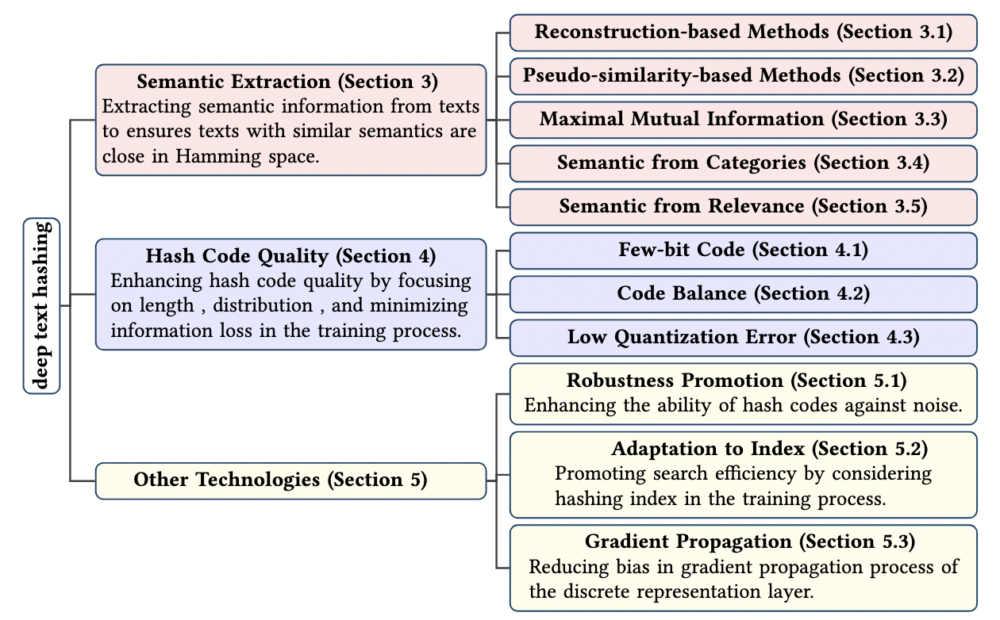

# 深度文本哈希综述：基于二进制表示的高效语义文本检索

[](https://arxiv.org/abs/2510.27232)
[](LICENSE)
[](https://www.python.org/)
[](https://pytorch.org/)
[](README.md) [](README_CN.md)

本仓库精选了以**深度文本哈希**为主题的研究论文，基于我们的综述论文《A Survey on Deep Text Hashing: Efficient Semantic Text Retrieval with Binary Representation》整理而成。论文列表将定期更新，如发现任何错误或遗漏，欢迎提交issue或pull request。



## 目录

- [模型](#模型)
- [快速开始](#快速开始)
- [数据集](#数据集)
- [论文列表](#论文列表)
- [引用](#引用)

## 模型

我们使用 **PyTorch** 框架实现了多个深度文本哈希模型，代码结构参考了 [VDSH](https://github.com/bayesquant/VDSH) 仓库。

### 已实现模型

| 模型 | 论文 | 发表会议 | 状态 |
| ---- | ---- | -------- | ---- |
| VDSH | Variational deep semantic hashing for text documents | SIGIR'2017 | ✅ |
| NbrReg | Deep semantic text hashing with weak supervision | SIGIR'2018 | ✅ |
| NASH | Toward end-to-end neural architecture for generative semantic hashing | ACL'2018 | ✅ |
| B-VAE | A binary variational autoencoder for hashing | CIARP'2019 | ✅ |
| Doc2Hash | Learning discrete latent variables for documents retrieval | NAACL'2019 | ✅ |
| RBSH | Unsupervised neural generative semantic hashing | SIGIR'2019 | ✅ |
| AMMI | Learning discrete structured representations by adversarially maximizing mutual information | ICML'2020 | ✅ |
| PairRec | Unsupervised semantic hashing with pairwise reconstruction | SIGIR'2020 | ✅ |
| WISH | Unsupervised few-bits semantic hashing with implicit topics modeling | EMNLP'2020 | ✅ |
| MISH | Unsupervised multi-index semantic hashing | WWW'2021 | ✅ |
| SNUH | Integrating semantics and neighborhood information | ACL'2021 | ✅ |
| SSB-VAE | Self-supervised bernoulli autoencoders for semi-supervised hashing | CIARP'2021 | ✅ |
| SMASH | An efficient and robust semantic hashing framework | TOIS'2023 | ✅ |
| HierHash | Multi-grained prototype-induced hierarchical generative model | EMNLP'2024 | ✅ |
| DHSH | De-confusing hard samples for text semantic hashing | ICASSP'2025 | ✅ |

> **注意：** 由于数据预处理方式的差异，不同模型的结果可能与原论文有所偏差。我们正在努力统一数据处理流程和评估指标。

### 项目结构

```
DeepTextHashing/
├── models/              # 模型实现
│   ├── VDSH/
│   ├── NbrReg/
│   ├── NASH/
│   ├── B-VAE/
│   ├── Doc2Hash/
│   ├── RBSH/
│   ├── AMMI/
│   ├── PairRec/
│   ├── WISH/
│   ├── MISH/
│   ├── SNUH/
│   ├── SSB-VAE/
│   ├── SMASH/
│   ├── HierHash/
│   └── DHSH/
├── textdata/            # 数据集加载工具
├── utils/               # 预处理和评估工具
└── requirements.txt
```

## 快速开始

### 1. 安装依赖

```bash
pip install -r requirements.txt
```

### 2. 数据预处理

参考 `utils/` 文件夹中的代码进行数据预处理：

```bash
python utils/preprocess.py --dataset ng20
```

### 3. 训练模型

数据准备完成后，运行以下命令训练模型：

```bash
sh models/{model_name}/train.sh
```

例如：
```bash
sh models/VDSH/train.sh
```

## 数据集

我们整理了文本哈希研究中常用的基准数据集，涵盖不同领域，具有不同的规模和标签类型。详细介绍请参阅我们的综述论文。

| 数据集 | 样本数 | 类别数 | 标签类型 | 链接 |
| ------ | ------ | ------ | -------- | ---- |
| 20Newsgroups | 18,846 | 20 | 单标签 | [链接](https://scikit-learn.org/0.19/datasets/twenty_newsgroups.html) |
| Agnews | 127,600 | 4 | 单标签 | [链接](http://groups.di.unipi.it/gulli/AG_corpus_of_news_articles.html) |
| Reuters | 10,788 | 90/20 | 多标签 | [链接](https://www.nltk.org/book/ch02.html) |
| DBpedia | 60,000 | 14 | 单标签 | [链接](https://www.csie.ntu.edu.tw/cjlin/libsvmtools/datasets/multilabel.html) |
| RCV1 | 804,414 | 103/4 | 多标签 | [链接](https://catalog.data.gov/dataset/siam-2007-text-mining-competition-dataset) |
| TMC | 28,596 | 22 | 多标签 | [链接](https://catalog.data.gov/dataset/siam-2007-text-mining-competition-dataset) |
| NYT | 11,527 | 26 | 单标签 | [链接](https://emilhvitfeldt.github.io/textdata/reference/dataset_dbpedia.html) |
| Yahooanswer | 1,460,000 | 10 | 单标签 | [链接](https://www.kaggle.com/soumikrakshit/yahoo-answers-dataset) |

## 论文列表

### 标记说明

| 标记 | 含义 |
| ---- | ---- |
|  | 基于重建的方法 |
| -brightgreen) | 对潜在表示施加先验 (X: G=高斯, B=伯努利, M=混合, C=分类, BM=玻尔兹曼, GA=图) |
|  | 基于伪相似度的方法 |
|  | 最大互信息方法 |
|  | 从类别中学习语义 |
|  | 从相关性中学习语义 |
|  | 促进编码平衡 |
|  | 促进少比特编码 |
| -red) | 使用量化方法 (X: Loss=量化损失, Sgn=符号函数, Sigmoid, Tanh, STanh=缩放tanh) |
|  | 提升哈希码鲁棒性 |
|  | 离散层反向传播的梯度优化 |
|  | 适配哈希索引 |

### 论文

+ **De-confusing Hard Samples for Text Semantic Hashing.** In **ICASSP'2025**
[Paper](https://ieeexplore.ieee.org/abstract/document/10889846).\
,SFC,SFR-brightgreen)
-red)

+ **Document Hashing with Multi-Grained Prototype-Induced Hierarchical Generative Model.** In **EMNLP'2024** [Paper](https://aclanthology.org/2024.findings-emnlp.18.pdf).\
,MMI,Pse-brightgreen)

+ **Efficient similar exercise retrieval model based on unsupervised semantic hashing.** In **JCA'2024** \

-red)

+ **Towards Efficient Coarse-grained Dialogue Response Selection.** In **TOIS'2023** [Paper](https://dl.acm.org/doi/abs/10.1145/3597609).\


+ **An efficient and robust semantic hashing framework for similar text search.** In **TOIS'2023** [Paper](http://staff.ustc.edu.cn/~qiliuql/files/Publications/Liyang-He-TOIS22.pdf) [Code](https://github.com/hly1998/SMASH).\

-red)


+ **Exploiting Multiple Features for Hash Codes Learning with Semantic-Alignment-Promoting Variational Auto-encoder.** In **NLPCC'2023** [Paper](https://link.springer.com/chapter/10.1007/978-3-031-44693-1_44). \
,Pse-brightgreen)
-red)

+ **Intra-category aware hierarchical supervised document hashing.** In **TKDE'2022** [Paper](https://ieeexplore.ieee.org/abstract/document/9740429) [Code](https://github.com/Academic-Hammer/IHDH).\

,Quan(STanh)-red)

+ **Accelerating code search with deep hashing and code classification.** In **ACL'2022** [Paper](https://arxiv.org/pdf/2203.15287).\

-red)

+ **LASH: Large-scale academic deep semantic hashing.** In **TKDE'2021** [Paper](https://ieeexplore.ieee.org/abstract/document/9529077/).\

-red)

+ **Efficient passage retrieval with hashing for open-domain question answering.** In **ACL'2021** [Paper](https://arxiv.org/pdf/2106.00882) [Code](https://github.com/studio-ousia/bpr).\

-red)

+ **Refining BERT embeddings for document hashing via mutual information maximization.** In **EMNLP'2021** [Paper](https://arxiv.org/pdf/2109.02867) [Code](https://github.com/J-zin/DHIM).\

-red)

+ **Integrating Semantics and Neighborhood Information with Graph-Driven Generative Models for Document Retrieval.** In **ACL/IJCNLP'2021** 
[Paper](https://arxiv.org/pdf/2105.13066) [Code](https://github.com/J-zin/SNUH).\
-brightgreen)
-red)

+ **Unsupervised multi-index semantic hashing.** In **WWW'2021**
[Paper](https://arxiv.org/pdf/2103.14460) [Code](https://github.com/Varyn/MISH).\
,Pse-brightgreen)
-red)


+ **Self-supervised bernoulli autoencoders for semi-supervised hashing.** In **CIARP'2021**
[Paper](https://arxiv.org/pdf/2007.08799) [Code](https://github.com/amacaluso/SSB-VAE).\
,SFC,SFR-brightgreen)
-red)

+ **Conditional text hashing utilizing pair-wise multi class labels.** In **ICICEL'2020**
[Paper](http://www.icicel.org/ell/contents/2020/4/el-14-04-13.pdf).\
,SFR-brightgreen)

+ **Discrete wasserstein autoencoders for document retrieval.** In **ICASSP'2020**
[Paper](https://ieeexplore.ieee.org/stamp/stamp.jsp?tp=&arnumber=9053129).\


+ **Pairwise supervised hashing with Bernoulli variational auto-encoder and self-control gradient estimator.** In **UAI'2020**
[Paper](https://arxiv.org/pdf/2005.10477).\
,SFR-brightgreen)
-red)


+ **Efficient implicit unsupervised text hashing using adversarial autoencoder.** In **WWW'2020**
[Paper](https://dl.acm.org/doi/pdf/10.1145/3366423.3380150) [Code](https://github.com/khoadoan/daba-hashing).\

-red)


+ **Generative semantic hashing enhanced via Boltzmann machines.** In **WWW'2020**
[Paper](https://arxiv.org/pdf/2006.08858).\
-brightgreen)
-red)

+ **Unsupervised few-bits semantic hashing with implicit topics modeling.** In **EMNLP'2020**
[Paper](https://aclanthology.org/2020.findings-emnlp.233.pdf) [Code](https://github.com/smartyfh/wish).\
-brightgreen)
-red)

+ **Learning discrete structured representations by adversarially maximizing mutual information.** In **ICML'2020**
[Paper](https://arxiv.org/pdf/2004.03991) [Code](https://github.com/karlstratos/ammi).\


+ **node2hash: Graph aware deep semantic text hashing.** In **Inf.Process.Manag.'2020**
[Paper](https://www.sciencedirect.com/science/article/abs/pii/S0306457319301827) [Code](https://github.com/unsuthee/node2hash).\
,Pse-brightgreen)


+ **Unsupervised semantic hashing with pairwise reconstruction.** In **SIGIR'2020**
[Paper](https://arxiv.org/pdf/2007.00380) [Code](https://github.com/casperhansen/PairRec).\
,Pse-brightgreen)
-red)


+ **Hashing based answer selection.** In **AAAI'2020**
[Paper](https://arxiv.org/pdf/1905.10718).\

-red)

+ **Document Hashing with Mixture-Prior Generative Models.** In **EMNLP'2019**
[Paper](https://arxiv.org/pdf/1908.11078v1).\
-brightgreen)
-red)

+ **Doc2hash: Learning discrete latent variables for documents retrieval.** In **NAACL'2019**
[Paper](https://aclanthology.org/N19-1232.pdf) [Code](https://github.com/yifeiacc/doc2hash).\
-brightgreen)


+ **A binary variational autoencoder for hashing.** In **CIARP'2019**
[Paper](https://link.springer.com/chapter/10.1007/978-3-030-33904-3_12).\
-brightgreen)
-red)


+ **Unsupervised neural generative semantic hashing.** In **SIGIR'2019**
[Paper](https://arxiv.org/pdf/1906.00671).\
,Pse-brightgreen)
-red)


+ **Short text analysis based on dual semantic extension and deep hashing in microblog.** In **TIST'2019**
[Paper](https://dl.acm.org/doi/pdf/10.1145/3326166).\

-red)


+ **Variational deep semantic text hashing with pairwise labels.** In **IMCOM'2019**
[Paper](https://link.springer.com/chapter/10.1007/978-3-030-19063-7_85).\
,SLR-brightgreen)

+ **Nash: Toward end-to-end neural architecture for generative semantic hashing.** In **ACL'2018**
[Paper](https://aclanthology.org/P18-1190.pdf) [Code](https://github.com/donggyukimc/nash).\
-brightgreen)
-red)


+ **Deep semantic text hashing with weak supervision.** In **SIGIR'2018**
[Paper](https://dl.acm.org/doi/pdf/10.1145/3209978.3210090).\
,Pse-brightgreen)

+ **Variational deep semantic hashing for text documents.** In **SIGIR'2017**
[Paper](https://arxiv.org/pdf/1708.03436) [Code](https://github.com/unsuthee/VariationalDeepSemanticHashing/blob/master/VDSH.py).\
-brightgreen)

+ **A Document Modeling Method Based on Deep Generative Model and Spectral Hashing.** In **KSEM'2016**
[Paper](https://link.springer.com/chapter/10.1007/978-3-319-47650-6_32).\


+ **Understanding short texts through semantic enrichment and hashing.** In **TKDE'2015**
[Paper](https://ieeexplore.ieee.org/stamp/stamp.jsp?tp=&arnumber=7286811).\


+ **Convolutional neural networks for text hashing.** In **IJCAI'2015**
[Paper](https://www.ijcai.org/Proceedings/15/Papers/197.pdf).\


## 引用

如果本仓库对您有帮助，请引用我们的综述论文：

```bibtex
@article{he2025survey,
  title={A Survey on Deep Text Hashing: Efficient Semantic Text Retrieval with Binary Representation},
  author={He, Liyang and Huang, Zhenya and Yang, Cheng and Li, Rui and Zhang, Zheng and Zhang, Kai and Li, Zhi and Liu, Qi and Chen, Enhong},
  journal={arXiv preprint arXiv:2510.27232},
  year={2025}
}
```
